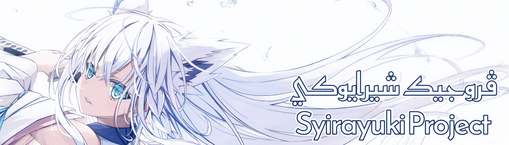

[Malay (Jawi)](README_ms.md) // [Malay (Latin)](README.md)

</img>

    </img>

</img>

A project with the goal of translating Japanese entertainment media into Bahasa Melayu (Malaysia) written in Rumi and [Jawi][Jawi] script.
Despite the slow pace, Project Syirayuki will still try its best in providing high quality translations as well as beautiful typesetting.

All subtitles translated by Projek Syirayuki are open sourced in the hope that it will be a benefit for a future generations.

See, study, copy and fork it out. Credit are much appreciated but not necessary.

</img>

[Jawi]: https://ms.wikipedia.org/wiki/Tulisan_Jawi
